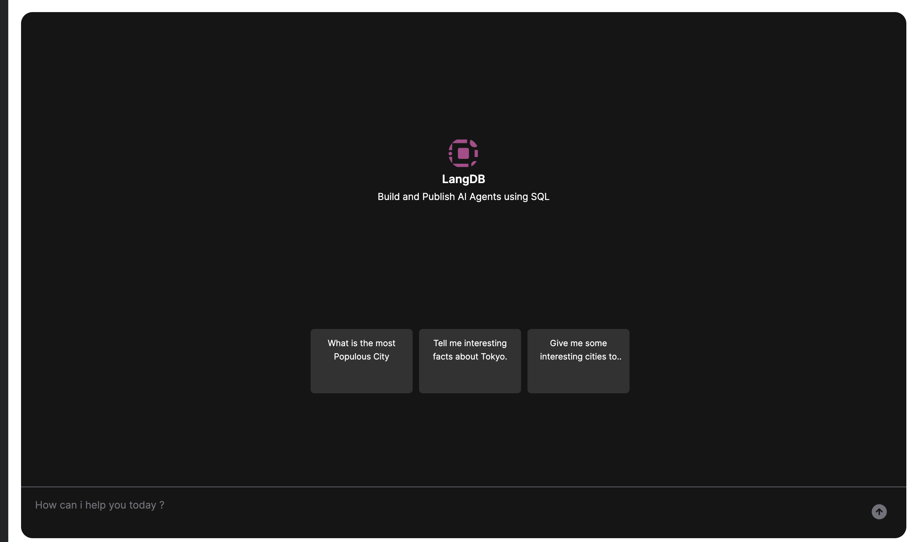

## Langdb Widget

Widget component interacting with LangDB APIs. Visit [docs](https://langdb.ai/docs/langdb/) to get started.s


## Running  locally
```bash
npm run storybook

npm run lint

npm run build
```

## Usage
Checkout the sample [storybook](./src/components/__docs__/Example.tsx) provided. 



```ts
import { Widget } from "@langdb/widget";

const Chat = () => {
  return (
      <Widget 
        publicId={publicId}
        agentName={'cities_chat'}
        advancedOptions={{
          conversationOptions: {
            conversationStarters: [
              {
                prompt: 'What is the most Populous City'
              },
              {
                prompt: 'Tell me interesting facts about Tokyo.'
              },
              {
                prompt: 'Give me some interesting cities to visit.'
              }
            ]
          }
        }}
      />
  );
};

export default Chat;
```
